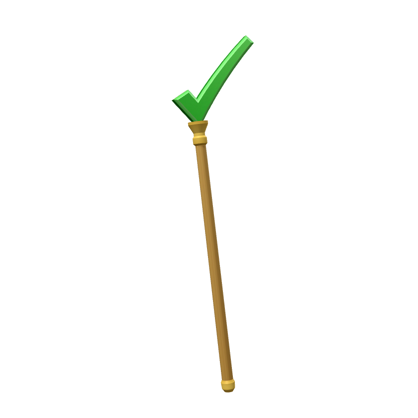
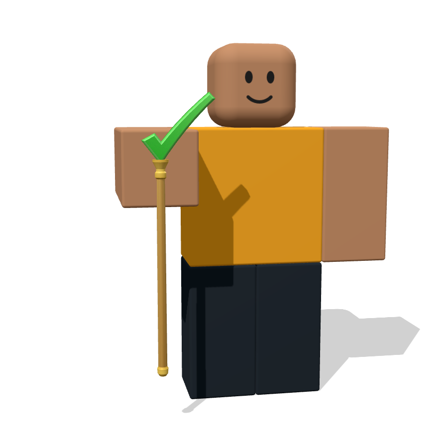

# Check Staff (Roblox UGC)

Goldener Stab mit einem grünen 3D-Haken statt des $-Zeichens.

| Datei | Inhalt |
| --- | --- |
| `check_staff.obj` | 3D-Modell (ein Mesh, 476 Dreiecke) |
| `check_staff.mtl` | Material, verweist auf die Textur |
| `check_staff_texture.png` | Textur, 256×256 |
| `preview_*.png` | Vorschau-Renders |
| `generate.py` | Skript, das Modell und Textur erzeugt (`python3 generate.py`) |

## Maße

- 1 Einheit = 1 Stud, Y zeigt nach oben, die Vorderseite des Hakens zeigt nach −Z (Roblox-Vorne)
- Größe: ca. 0,95 × 3,73 × 0,21 Studs

## In Roblox Studio importieren

1. **Avatar**-Tab → **Import 3D** → `check_staff.obj` auswählen (alle drei Dateien im selben Ordner lassen).
2. Falls die Textur nicht automatisch drauf ist: `check_staff_texture.png` hochladen und als **TextureID** des MeshParts setzen.
3. Mit dem **Accessory Fitting Tool** ein Accessoire daraus machen. Roblox hat keinen Hand-Slot, Stäbe werden meist als **Back**-Accessoire (schräg auf dem Rücken) hochgeladen. Wenn das Tool meldet, dass das Item zu groß ist, im Tool herunterskalieren.

