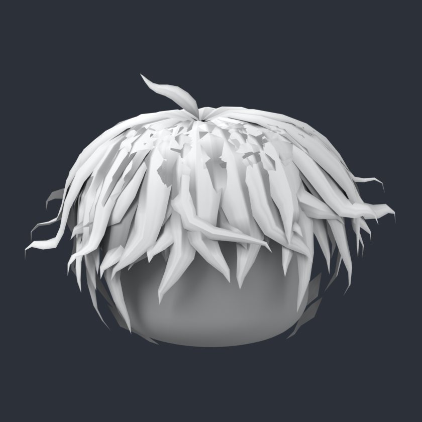
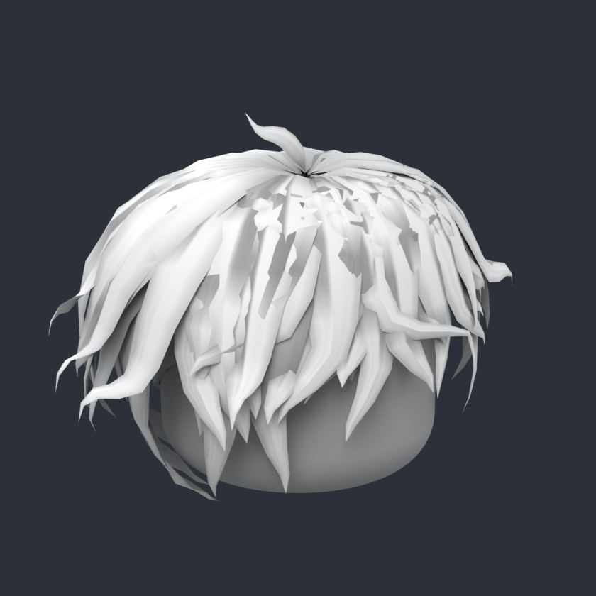
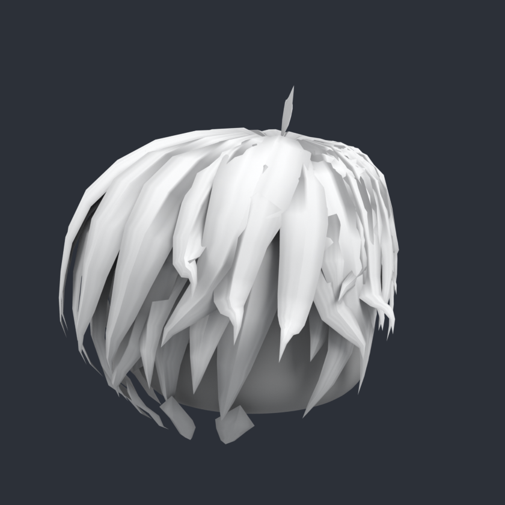
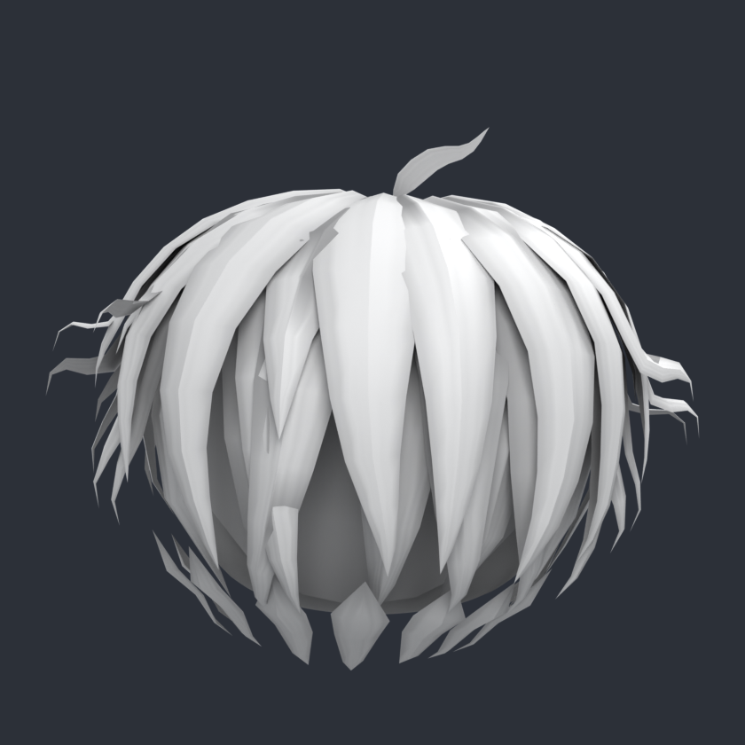

# Messy Silver Hair (Roblox UGC)

Wuschelige weiße Anime-Haare, nachgebaut nach deinem Bild: Alle Strähnen wachsen aus einem Wirbel oben auf dem Kopf. Vorne fällt ein Pony über die Stirn, an den Seiten rollen sich lange Strähnen nach außen ein, im Nacken hängen kurze Spitzen und oben steht eine Ahoge ab.

| Datei | Inhalt |
| --- | --- |
| `messy_hair.obj` | 3D-Modell (ein Mesh, 3.942 Dreiecke) |
| `messy_hair.mtl` | Material, verweist auf die Textur |
| `messy_hair_texture.png` | Textur, 1024×1024, mit eingebackener Schattierung |
| `preview_*.png` | Vorschau-Renders auf einem grauen klassischen Roblox-Kopf |
| `generate.py` | Skript, das Modell und Textur erzeugt (`python3 generate.py`) |
| `render_previews.py` | Skript für die Vorschaubilder (Blender, siehe unten) |

## Maße und Roblox-Vorgaben

- 1 Einheit = 1 Stud, Y zeigt nach oben, die Vorderseite zeigt nach −Z (Roblox-Vorne)
- Gebaut für den klassischen Kopf (1,2 × 1,2 × 1,2 Studs, Body Scale **Classic**)
- Größe: ca. 2,25 × 1,73 × 1,73 Studs
- Vom HairAttachment aus: 0,35 nach oben, 1,38 nach unten, 0,75 nach vorn, 0,98 nach hinten, je 1,13 zur Seite. Roblox erlaubt für Haare (Classic) 2 / 3 / 1,5 / 2 / 1,5.
- 3.942 Dreiecke, das Limit für Accessoires ist 4.000
- Wasserdicht: 80 Strähnen und eine Kopfhaut-Schale, alle geschlossen und nach außen gerichtet. `generate.py` prüft das bei jedem Lauf.
- Textur 1024×1024, das Limit ist 2048×2048

## In Roblox Studio importieren

1. Alle drei Dateien (`.obj`, `.mtl`, `.png`) in denselben Ordner legen.
2. Im Tab **Avatar** auf **Import 3D** gehen und `messy_hair.obj` auswählen. Das Haar sollte etwa 2,25 Studs breit sein. Falls die Größe nicht stimmt, in den Import-Einstellungen als Einheit „Stud“ wählen.
3. Falls die Textur nicht automatisch drauf ist: `messy_hair_texture.png` hochladen und als **TextureID** des MeshParts setzen.
4. Mit dem **Accessory Fitting Tool** ein Accessoire daraus machen: Typ **Hair**, Body Scale **Classic**.
5. Falls das Haar danach nicht richtig auf dem Kopf sitzt: Im `Handle` das `HairAttachment` auf die Position **(0.004, 0.515, -0.112)** setzen. Dann sitzt es wie in den Vorschaubildern.
6. Für den Marketplace verlangt Roblox: Material **Plastic**, Transparency **0**, VertexColor **1, 1, 1** und keine Scripts oder zusätzlichen Parts im Accessory.

| Schräg | Seite | Hinten |
| --- | --- | --- |
|  |  |  |

## Anpassen

- **Farbe:** `LIGHT` und `DARK` in `generate.py` ändern (z. B. für schwarze oder blonde Haare) oder einfach die PNG einfärben.
- **Form:** Die Strähnen stehen in `hair_strands()`. `WIDTH_SCALE` macht alle Strähnen breiter oder schmaler, die `ENV_*`-Werte bestimmen das Volumen.
- Danach `python3 generate.py` ausführen (braucht `numpy` und `pillow`). Das Skript bricht ab, wenn das Modell mehr als 4.000 Dreiecke hätte oder nicht mehr wasserdicht wäre.
- **Vorschau neu rendern:** `pip install bpy pillow`, dann `python render_previews.py`. Mit `--backfaces` werden Rückseiten rot eingefärbt; die würde Roblox im Spiel nicht anzeigen.
